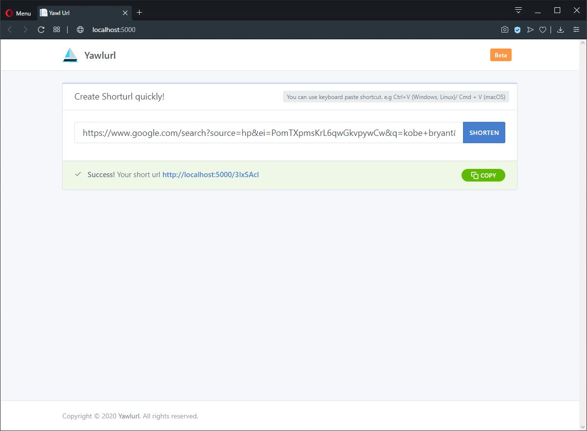

<h1> 
    YAWL URL</h1>

:link: Yawlurl is smart and easy url shortener system. It is a product that you can run in your own environment developed with asp.net core. The word meaning of Yawl is a small sail that briefly guides the ship. :shipit:

| Master | Develop |
|--------|---------|
|     |    |

## Build with
    
* **ASP.NET Core 3.0** An open-source, cross-platform web development framework 
* **MongoDB** One of the most popular NoSQL databases
* **Docker support** Docker is a tool designed to make it easier to create, deploy, and run applications by using containers.

## Core components
  * :heavy_check_mark: **Router** is performs basic routing operations 
  * :soon: **Api** provides communication with different application. 
  * :soon: **App** is a dashboard that provides application management and monitors the application.

# Beta Preview of Router Home Page

## Installation

    git clone https://github.com/Yawlurl/Yawlurl.git

If docker is running, run docker compose up command in Yawlurl project folder. 

    docker-compose up

Then open browser and enter http://localhost:5000. Yawlurl router will be working.